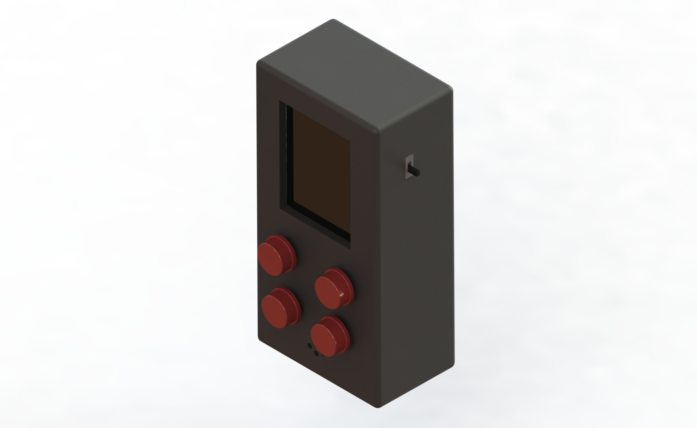
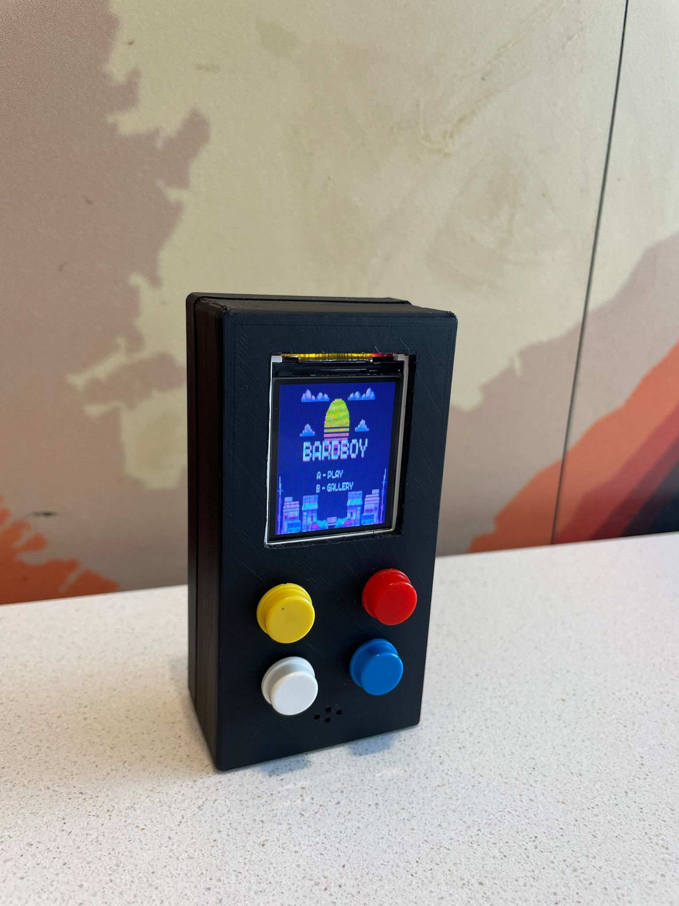

# Tetris Handle Game Console in Raspberry Pi Pico

This is a simple Tetris game console that runs on Raspberry Pi Pico. The game is written in MicroPython and uses a 128x160 LCD display and a 4 buttons.

## Hardware

- Raspberry Pi Pico 
- 1.8'' TFT LCD 128x160 ST7735
- 4 buttons
- Li-Po battery 3.7V
- Charge module tp4056
- Power switch
- 3D printed case

## Software
CircuitPython 9.0.0 or later is required to run this game. You can download the latest version of CircuitPython from the [CircuitPython website](https://circuitpython.org/board/raspberry_pi_pico/).

## Photos

